<figure markdown>
  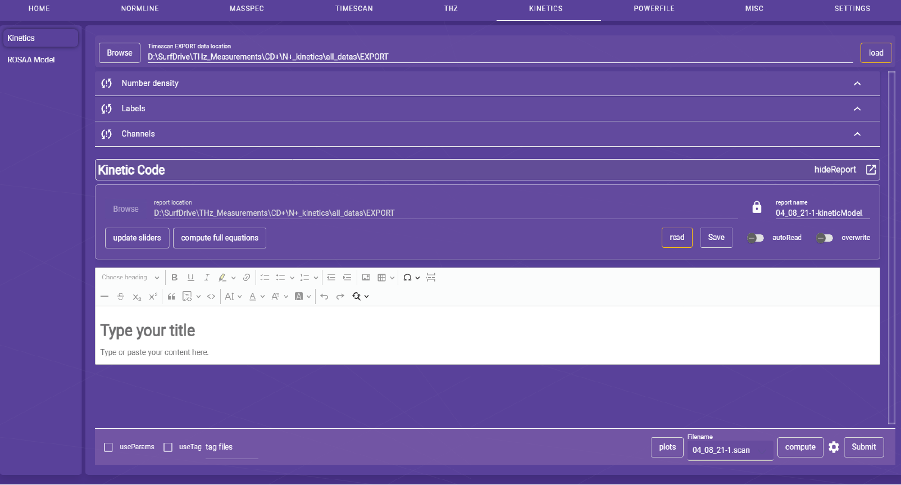{ align=left }
  <figcaption>Fig 7: Timescan kinetics homepage</figcaption>
</figure>

The kinetics page is used to analyze the kinetics of the FELion experiment. The kinetics page is divided into three panels.

## Making a new kinetics project

=== "Number density"
    <figure markdown>
        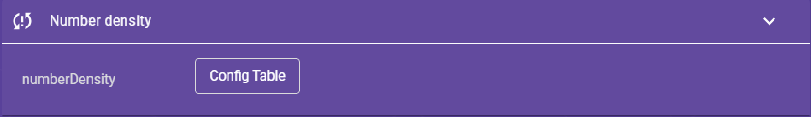{ align=left }
        <figcaption>Fig 8.1.0: Kinetics: Number density</figcaption>
    </figure>

    <figure markdown>
        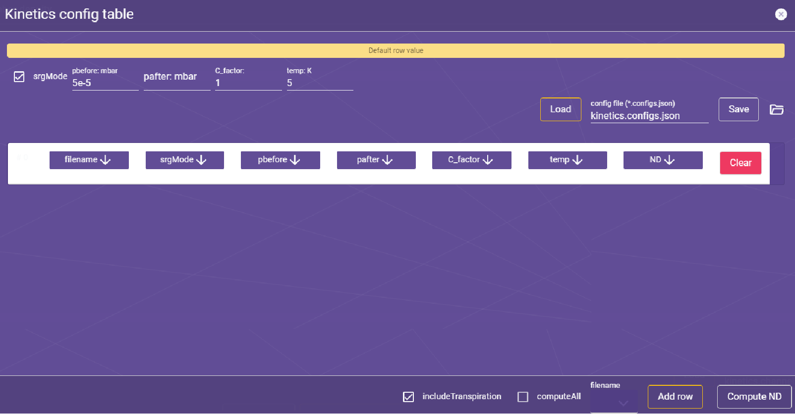{ align=left }
        <figcaption>Fig 8.1.1: Compute number density </figcaption>
    </figure>

    <figure markdown>
        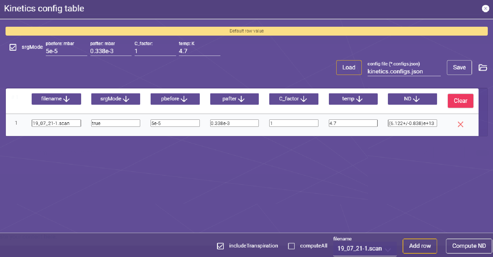{ align=left }
        <figcaption>Fig 8.1.2: Compute number density </figcaption>
    </figure>

=== "Labels"
    <figure markdown>
        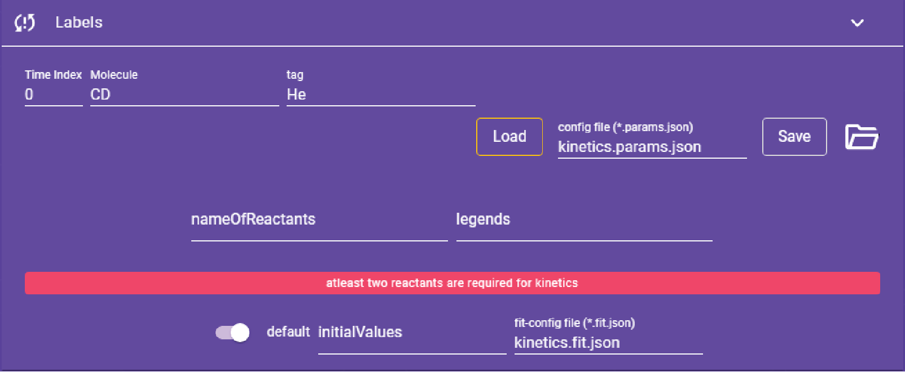{ align=left }
        <figcaption>Fig 8.2.1: Kinetics: Labels with default molecular ion (CD+) name and tag (helium)</figcaption>
    </figure>

    <figure markdown>
        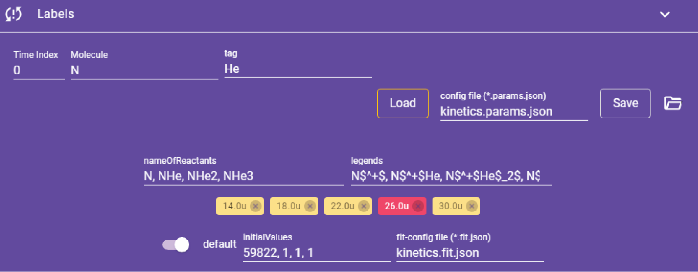{ align=left }
        <figcaption>Fig 8.2.2: Kinetics: Labels for N+ ion with He tag</figcaption>
    </figure>

=== "Channels"
    <figure markdown>
        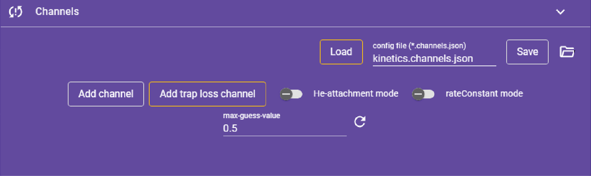{ align=left }
        <figcaption>Fig 8.3.1: Kinetics: Channels</figcaption>
    </figure>

    <figure markdown>
        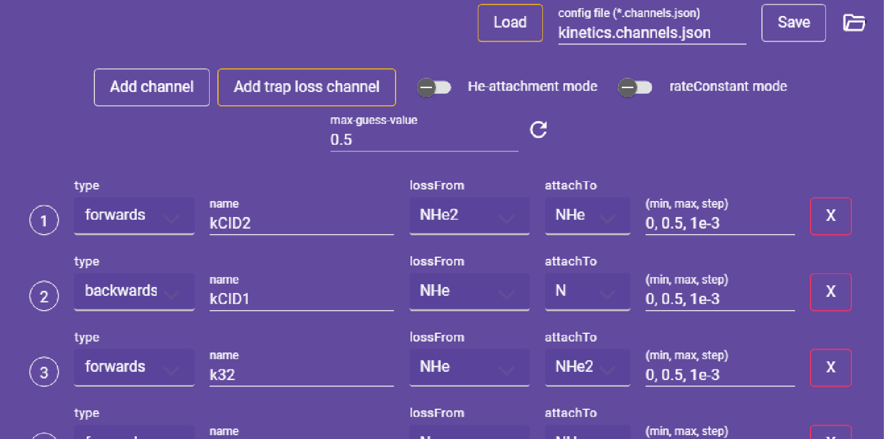{ align=left }
        <figcaption>Fig 8.3.2: Kinetics: Channels</figcaption>
    </figure>

???+ note "Note"
    - :material-sync-alert: indicates the data is not yet loaded.
    - :material-check: indicates the data is loaded.

## Rate of equation

=== "Defining the rate equation"
    <figure markdown>
        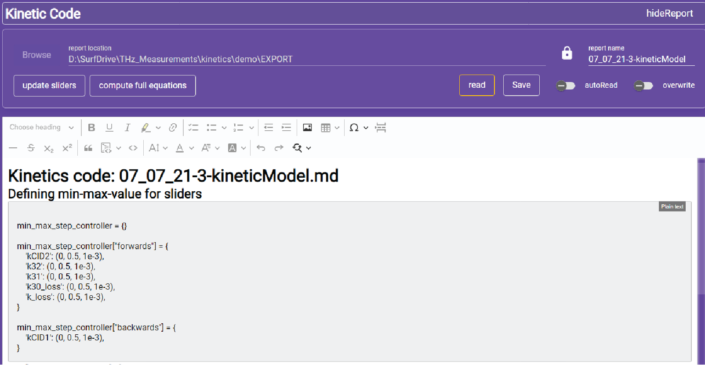{ align=left }
        <figcaption>Fig 9.1: Kinetic code: computing sliders</figcaption>
    </figure>

    <figure markdown>
        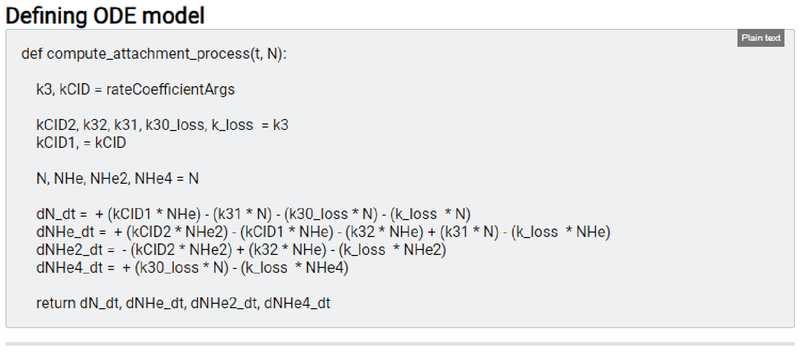{ align=left }
        <figcaption>Fig 9.2: Kinetic code: Full model equations</figcaption>
    </figure>

=== "Fitting rate equations"
    <figure markdown>
        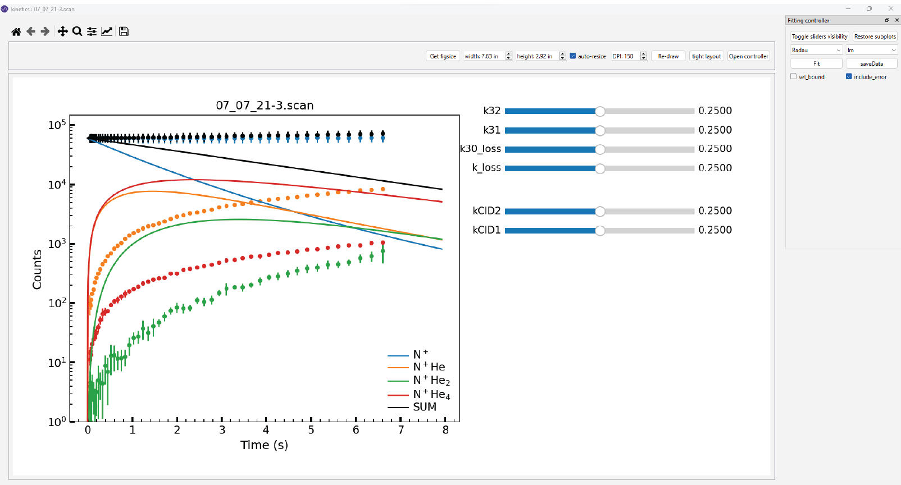{ align=left }
      <figcaption>Fig 10.1: Kinetic code: Fitting rate equations</figcaption>
    </figure>

    <figure markdown>
        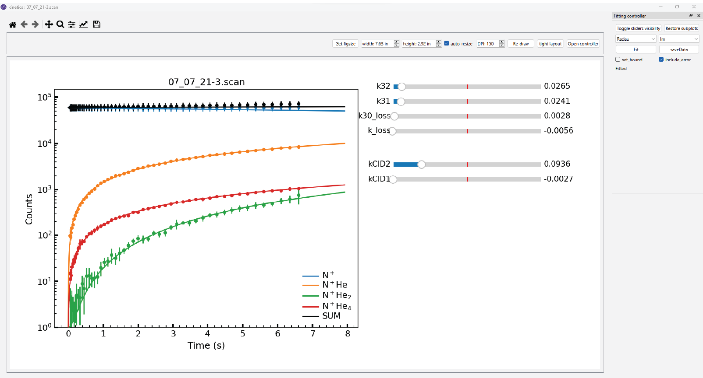{ align=left }
    <figcaption>Fig 10.1: Kinetic code: Fitting rate equations</figcaption>
    </figure>

## Kinetics plots

<figure markdown>
  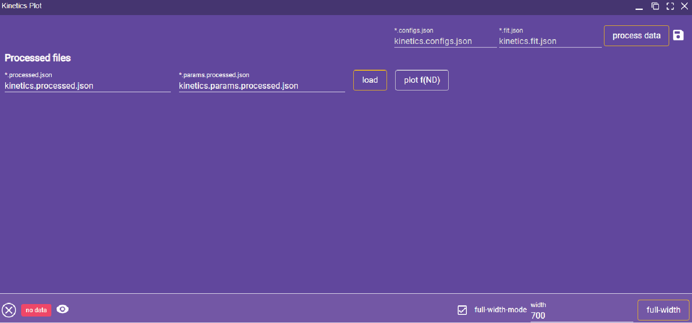{ align=left }
  <figcaption>Fig 11: Kinetic plots creating window</figcaption>
</figure>

## Flowchart

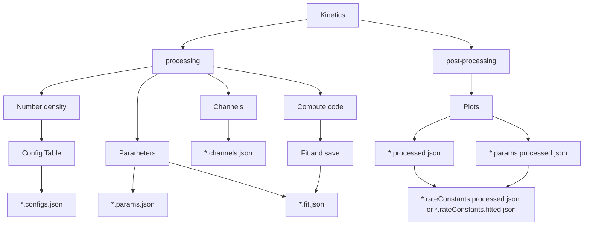
