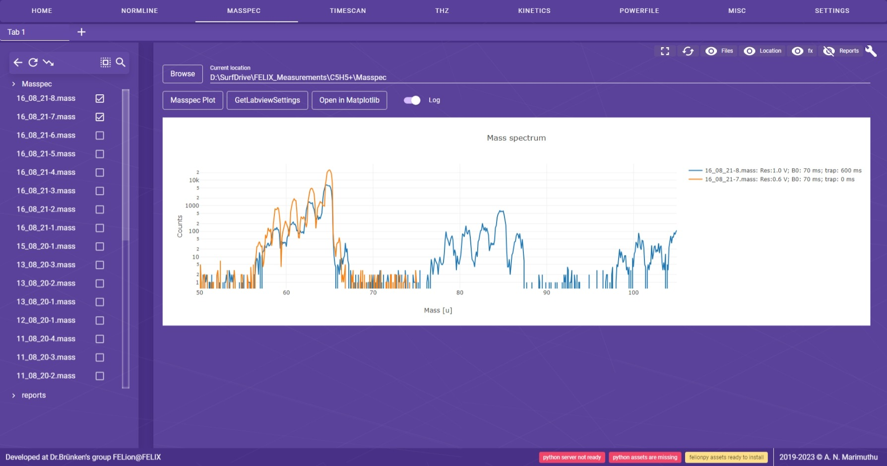
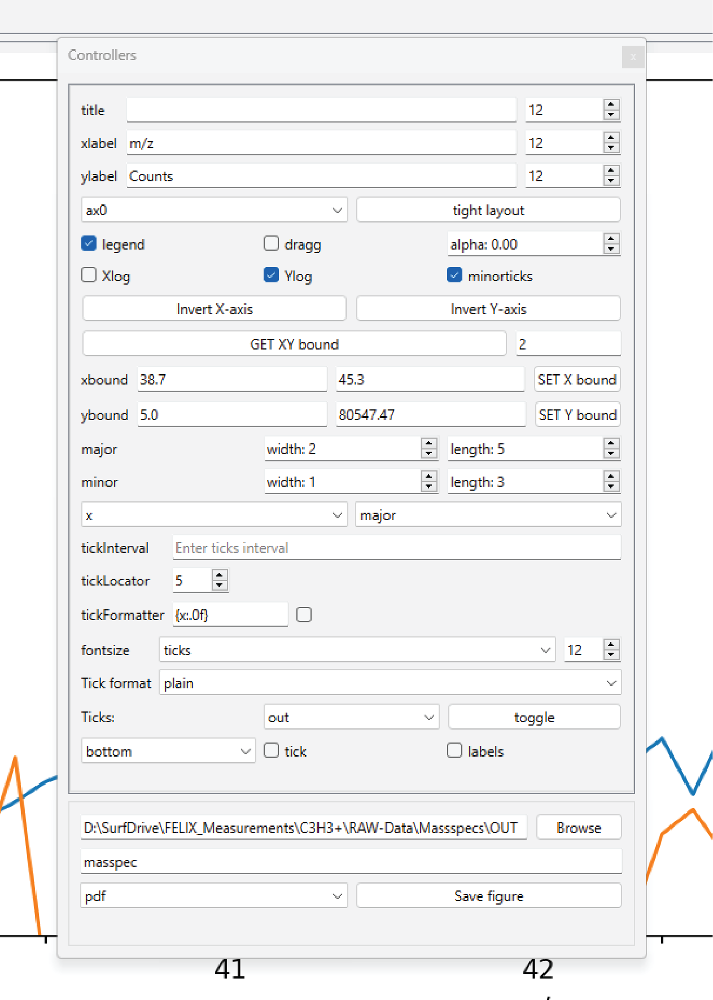

---
hide:
  - navigation
---

# Masspec

Masspec is used to analyze mass spectra obtained from the FELion instrument.
???+ note "file format"
    The mass spectra are saved in the `.mass` file format.

So just select the `.mass` file and it automatically loads the spectrum.

<figure markdown>
  { align=left }
  <figcaption>Fig 6: Mass spectrum of two selected file</figcaption>
</figure>

## Labview Settings

The `GetLabviewSettings` button is used to get the settings from the Labview software.
The settings are saved in the `.mass` file in itself at the end.

<figure markdown>
  { align=left }
  <figcaption>Fig 7: Labview settings for the selected file</figcaption>
</figure>

## Production-quality plots

The `Open in matplotlib` button is used to plot the mass spectrum in `matplotlib` and save it in a high-resolution image file.

<figure markdown>
  { align=left }
  <figcaption>Fig 8: High quality masspec figure</figcaption>
</figure>

<figure markdown>
  { align=left }
  <figcaption>Fig 9: Figure controller</figcaption>
</figure>
