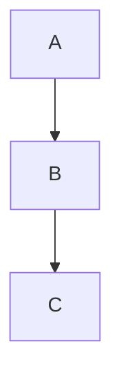
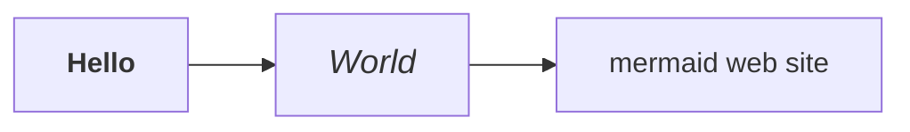
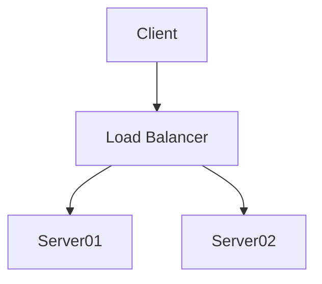
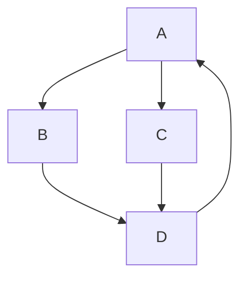
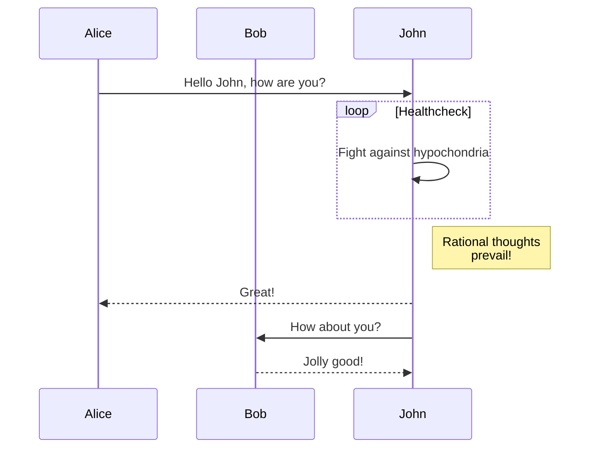

---
hide:
  - navigation
---

We can [link to that heading](layout.md#main-container) from another page too.

This works the same as [a normal link to that heading](./layout.md#hello-world).

Link [image](home.png){:target="_blank"}

## Mermaid graph demo

