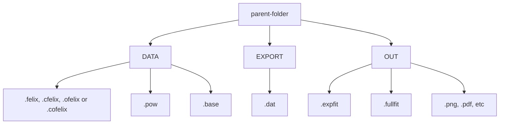

---
hide:
  - navigation
---

# Normline

## Functions

### Create baseline

Creating baseline for felix or opo IR spectrum

### FELIX plot

### OPO plot

### Theory plot

## Descriptions

### Folder structure

### Data types

| Name | Description | Data source |
| --- | --- | --- |
| __FELIX__
| .felix   | FELIX IR data | Instrument (Labview) |
| .cfelix  | corrected felix | created manually (FELionGUI) |
| .pow     | powerfile for felix | created manually (FELionGUI) |
| .base    | baseline for felix | created manually (FELionGUI) |
| __OPO__
| .ofelix  | OPO IR data | Instrument (Labview) |
| .cbase   | baseline for OPO | created manually (FELionGUI) |
| .cofelix | corrected ofelix | created manually (FELionGUI) |
| __Post-processed__
| .dat    | processed .*felix data | created manually (FELionGUI) |
| .expfit | Gaussian fit parameters | created manually (FELionGUI) |
| .fullfit | Multi-Gaussian fit parameters | created manually (FELionGUI) |
