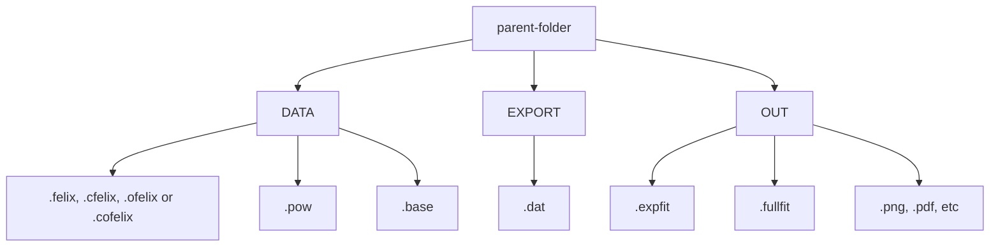

---
hide:
  - navigation
---

# Normline

## Folder structure

## Data types

| Name | Description | Data source |
| --- | --- | --- |
| __FELIX__
| .felix   | FELIX IR data | Instrument (Labview) |
| .pow     | powerfile for felix | Manual |
| .base    | baseline for felix | Manual |
| __OPO__
| .ofelix  | OPO IR data | Instrument (Labview) |
| .cfelix  | corrected felix | Manual |
| .cbase   | baseline for OPO | Manual |
| .cofelix | corrected ofelix | Manual |
| __Post-processed__
| .dat    | processed .*felix data | Manual |
| .expfit | Gaussian fit parameters | Manual |
| .fullfit | Multi-Gaussian fit parameters | Manual |

## Create baseline

Creating baseline for felix or opo IR spectrum

## FELIX plot

## OPO plot

## Theory plot
