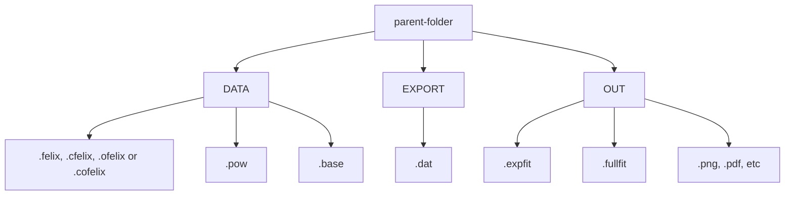

---
hide:
  - navigation
---

# Normline

## Data structure

```mermaid
graph TD
    Parent[parent-folder]

    Parent --> A
    Parent --> B
    Parent --> C

    A[DATA]
    B[EXPORT]
    C[OUT]
    
    A --> felix[.felix, .cfelix, .ofelix or .cofelix]
    A --> .pow
    A --> .base

    B --> .dat

    C --> .expfit
    C --> .fullfit
    C --> other[.png, .pdf, etc]

```

## Create baseline

Creating baseline for felix or opo IR spectrum

## FELIX plot

```mermaid
graph LR
  baseline[Create baseline] --> felix[FELIX plot] --> post-process
```

## OPO plot

```mermaid
graph LR
  opomode[OPO MODE] --> baseline[Create baseline] --> opo[OPO plot] --> post-process
```

## Theory plot
