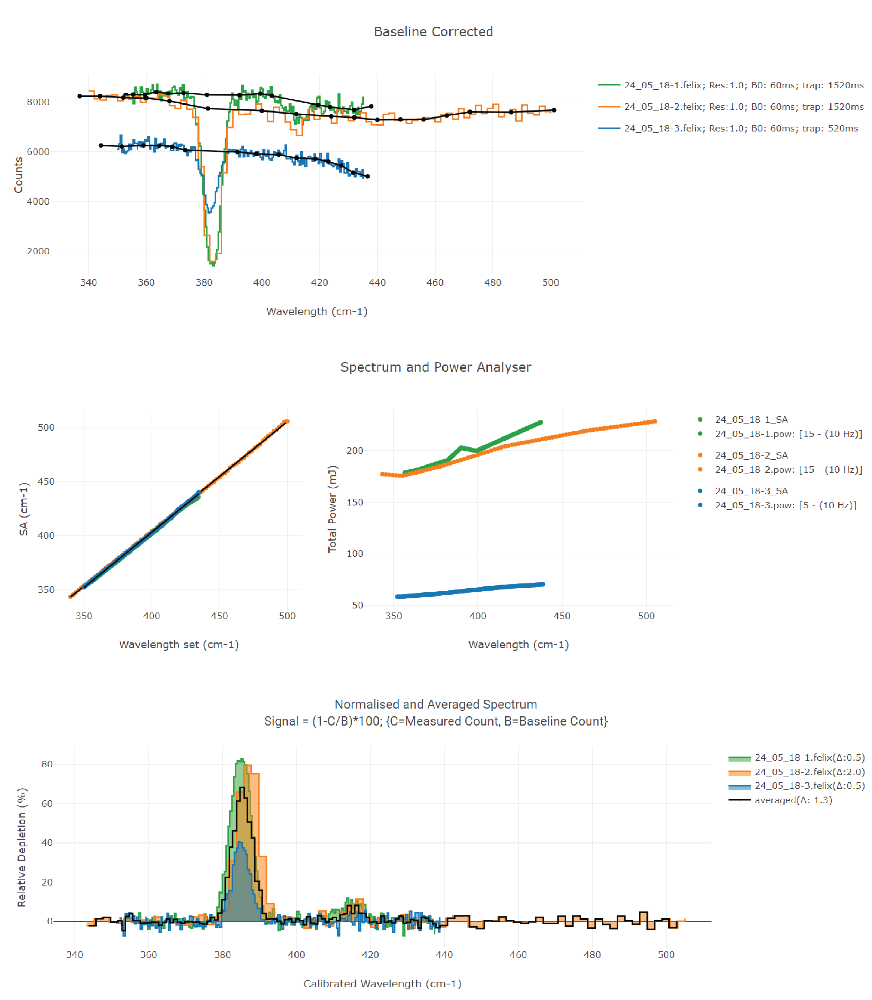

---
hide:
  - navigation
---
# Normline

Normline is the page where analysis of FELIX and OPO infrared data are processed such as baseline correction, wavelength and power calibration
In addition, one can do post-processing such as Gaussian and Multi-Gaussian line profile fitting fitting of experimental data to derive line parameters (FWHM, $\sigma$ and amplitude).

Before proceeding further, let us familirise with different data folder structure and processed and post-processed data types for FELIX and OPO IR data.

## Folder structure

???+ note
    .*felix indicates any of the following: .felix, .ofelix, .cfelix or .cofelix file

## Data types

| Name | Description | Data source |
| --- | --- | --- |
| __FELIX__
| .felix   | FELIX IR data | Instrument (Labview) |
| .cfelix  | corrected felix | created manually (FELionGUI) |
| .pow     | powerfile for felix | created manually (FELionGUI) |
| .base    | baseline for felix | created manually (FELionGUI) |
| __OPO__
| .ofelix  | OPO IR data | Instrument (Labview) |
| .cbase   | baseline for OPO | created manually (FELionGUI) |
| .cofelix | corrected ofelix | created manually (FELionGUI) |
| __Post-processed__
| .dat    | processed .*felix data | created manually (FELionGUI) |
| .expfit | Gaussian fit parameters | created manually (FELionGUI) |
| .fullfit | Multi-Gaussian fit parameters | created manually (FELionGUI) |

## Step-by-step procedure

### Create baseline

Creating baseline for felix or opo IR spectrum

The procedure of processing the data are as given below in flowchart:

As shown in above flowchart, the first step is to create a baseline

???+ info
    The measured .*felix file is copied into a folder (called parent folder as mentioned in above flowchart) followed by baseline creation `Create baseline`.
    If the parent folder is empty the following directories `DATA`, `EXPORT` and `OUT` are automatically generated and the copied .felix or .ofelix files are copied into the `DATA` folder.

<figure markdown>
  { align=left }
  <figcaption>Fig 3: Normline: Main functions (in default mode, i.e., FELIX mode)</figcaption>
</figure>

???+ info
    Normally files are selected by mouse `left-click`. However, to select a file for creating baseline one has to do `ctrl` + `left-click`.
    As shown in Fig 3, selected files are indicated by :fontawesome-regular-square-check: and the selected file for baseline correction has a solid orange coloured border.

???+ note
    If the `parent-folder` is empty and this is the first time you are processing the file, then after baseline creation you should refresh (:material-refresh:) and move into `DATA` folder.

<figure markdown>
  { align=left }
  <figcaption>Fig 4: Baseline creation</figcaption>
</figure>

### FELIX

#### Powerfile

Create powerfile (.pow) for corresponding (.felix) file

<figure markdown>
  { align=left }
  <figcaption>Fig 4: Baseline creation</figcaption>
</figure>

#### FELIX plot

As shown above, once baseline is created click on `FELIX plot` button to analysis FELIX IR data (from .felix file).

<figure markdown>
  { align=left }
  <figcaption>Fig 5: Normline: FELIX plot analysis</figcaption>
</figure>

### OPO

### Theory
